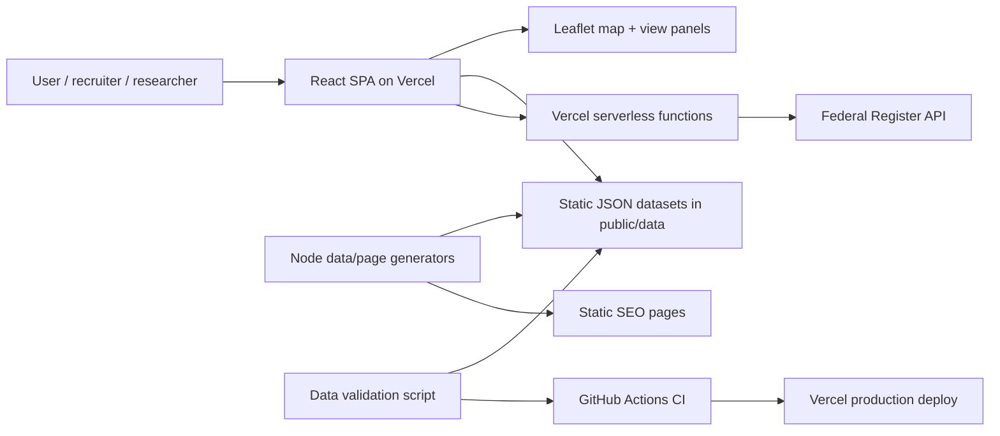
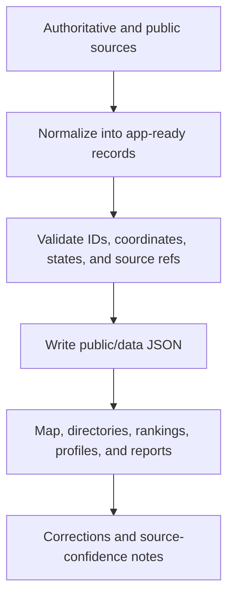

# US Grid Explorer

Interactive infrastructure intelligence for the U.S. power grid, data centers, transmission corridors, regional grid signals, and public-source development pressure.

[Live site](https://usgridexplorer.com) | [Data sources](docs/DATA_SOURCES.md) | [Attribution](ATTRIBUTION.md)


## What I Built

- Nationwide React + Leaflet infrastructure map with power plants, data centers, transmission lines, substations, fuel filters, search, and feature detail panels.
- Data pipelines that normalize EIA power-plant records, OpenStreetMap data-center records, state summaries, fuel directories, grid-region pages, glossary pages, and SEO landing pages.
- Live-adjacent grid and policy views, including EIA-930 grid signals and a Federal Register-powered data-center watch feed.
- Recruiter- and public-facing trust surfaces: data source notes, coverage warnings, correction workflow, confidence labels, sitemap, and custom production domain.
- Performance-minded map defaults that reduce first-render marker load while keeping high-value infrastructure categories easy to reveal.
- CI-ready validation script that checks required fields, coordinates, source references, duplicate IDs, and state codes before deployment.

## Screenshots


## Architecture



## Data Flow



## Data Sources

Core sources include:

- U.S. Energy Information Administration Form EIA-860 for power plants.
- U.S. Energy Information Administration EIA-930 for hourly balancing-authority demand.
- OpenStreetMap contributors for community-reported data-center features.
- Federal Register API for public notices related to data-center, energy, permitting, and grid infrastructure.
- Public ArcGIS services for transmission and substation layers.

See [docs/DATA_SOURCES.md](docs/DATA_SOURCES.md) and [ATTRIBUTION.md](ATTRIBUTION.md) for source details, licenses, caveats, and refresh notes.

## Tech Stack

- React 19, Vite, Leaflet, React Leaflet, Recharts, Lucide icons
- Node.js scripts for static page and data generation
- Vercel hosting, Vercel serverless functions, Vercel Analytics
- GitHub Actions for build and data validation

## Local Development

```powershell
npm.cmd install
npm.cmd run dev
```

## Quality Checks

```powershell
npm.cmd run validate:data
npm.cmd run build
```

The validation script checks required fields, point coordinates, source metadata, duplicate IDs, source references, and invalid U.S. state or territory codes.

## Production

Production is deployed on Vercel at [usgridexplorer.com](https://usgridexplorer.com). Every push to `main` runs GitHub Actions and triggers a Vercel deployment.

## Roadmap

- Automated source refresh workflows with visible last-checked dates.
- More state and regional editorial pages for high-intent search traffic.
- Expanded correction review flow and source confidence scoring.
- Optional AI guide activation after API billing is intentionally enabled.

## Feeds Source Monitor

The source monitor is a review-first discovery pipeline. It never publishes automatically and does not copy article text or images. It stores source metadata, extracts factual signals, scores relevance, groups related items, and marks Tier 2 or Tier 3 discoveries for primary-source verification.

### Source Tiers

- **Tier 1:** official agencies, ISO/RTOs, utilities, companies, operators, and government research. Use for factual grounding.
- **Tier 2:** specialist industry media and research. Use for discovery, then verify important claims with Tier 1.
- **Tier 3:** general news and press-release wires. Use for discovery only; unverified items remain `needs_review`.

The central registry is `src/data/sourceRegistry.js`. New entries must include the source URL, type, category, tier, reliability score, fetch method, full-text policy, paywall risk, notes, and enabled state. Keep uncertain feeds and local-government placeholders disabled until their exact URLs and access rules are confirmed.

### Manual Run

```powershell
npm.cmd run validate:sources
npm.cmd run monitor:feeds
npm.cmd run dev
```

Use the private local studio at `http://127.0.0.1:4175/` to review the queue and draft briefs. The monitor writes discoveries to `tools/feed-studio/data/feed-review-queue.json`. Studio decisions currently use browser local storage and do not alter the repository.

```powershell
npm.cmd run feed:studio
```

Scores combine matched topic keywords, title matches, source tier, and a data-center focus bonus. URL normalization and title similarity remove likely duplicates. Related items receive a shared group key. Tier 2 and Tier 3 items become verified only when related Tier 1 material exists in the same run.

Safe defaults are stored in `.env.example`. Keep `AUTO_PUBLISH=false`. GitHub Actions may eventually run the monitor on a schedule and open a pull request with queue changes. Vercel Cron should wait until persistent storage and authenticated admin access exist.

### Copyright and Source Use

- Always retain the original source name and URL.
- Use metadata and factual signals to create independent US Grid Explorer analysis.
- Do not rewrite articles sentence by sentence or publish substitutes for the originals.
- Do not copy source images without an explicit license.
- Do not fetch full text from paywalled sources.
- Require human verification and approval before publication.
